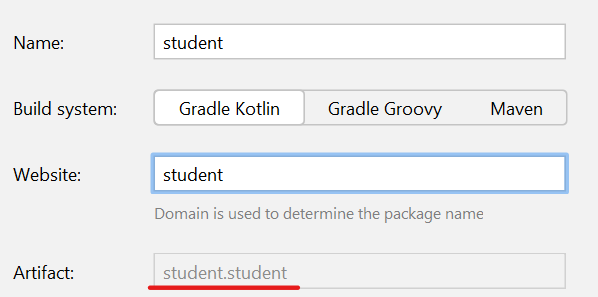
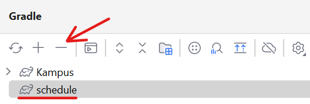
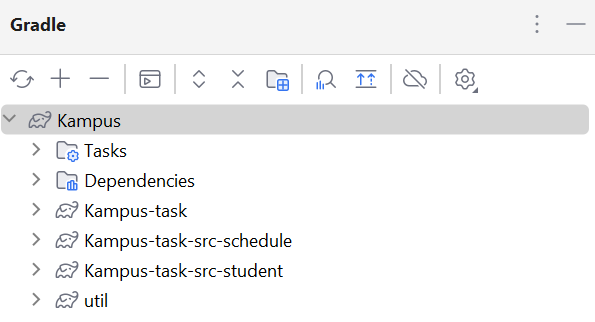
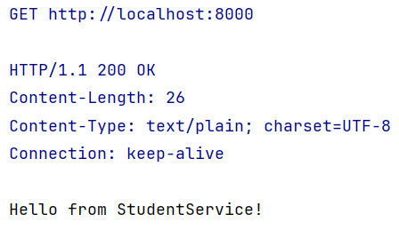
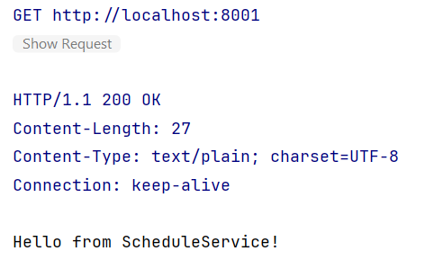

## Theory

When you submit a project stage for testing, the code you wrote runs as a subproject. This means that the root of the
gradle build is actually higher than the directory where you write the code. Since you have to create a multimodule
project, you need to consider several points in order for the project to launch successfully:

1. You need to avoid package conflicts. To do this, use different names for packages in microservices, and also try to
   use different class names:
   
2. Also, keep in mind that the plugin `kotlin("jvm")` is already defined in the build script at the project test level.
   Therefore, you don't need to write a version of this plugin in your build scripts:
    ```kotlin
    plugins {
        kotlin("jvm") // no version
        ...
    }
    ```
3. You don't need to create a _settings.gradle.kts_ file, all subprojects will be loaded automatically
4. After all, to successfully build a project in Idea, you need to exclude the created modules from gradle and run the gradle sync:
   

Example of correct gradle project configuration:



## Description

When you begin a project, one of the first things to plan is its structure. For our project, we're focusing on
microservices, which are like small building blocks that work together. Imagine them as special services helping us
handle specific tasks. We want to create two main services: one for managing students, which we'll
call `StudentService`,
and another for handling schedules, which we'll name `ScheduleService`.

`StudentService` handles actions like adding new students, updating their information, and removing them if needed. This
service is tailored to manage student-related tasks efficiently.

`ScheduleService` organizes and manages the schedules for classes, exams, and other important events in our project.
Each service has its unique role and responsibilities to make our project organized and smooth.

## Objectives

At this stage, you need to create two Ktor services that will run on different ports:

- **8000** for StudentService. When making a GET request to the endpoint "/", it should return the string "Hello from
  StudentService!".
- **8001** for ScheduleService. When making a GET request to the endpoint "/", it should return the string "Hello from
  ScheduleService!".

- Before running the tests, do not forget to start both servers so that they are accessible from the localhost.

## Examples

Request to the Student service:



Request to the Schedule service:


